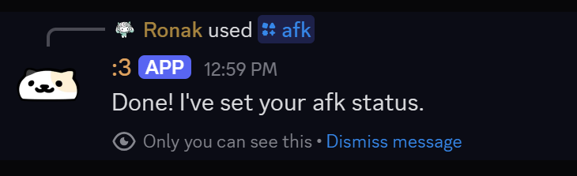
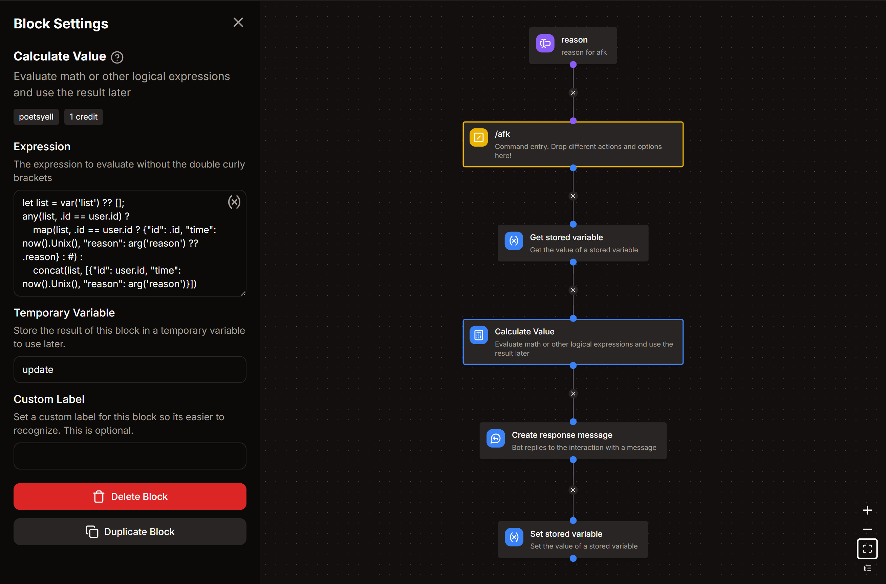

# AFK command

*this command would allow users to set their afk status*
`/afk`



## Arguments
- **`reason`**
    - Description : reason for going afk
    - Type : **Text**
    - Argument Required : **False** ( this argument should be set as optional )
    - Maximum Length : **200** ( change this as per your requirement )

## Get Stored Variable
- Variable : `afk`
- Set Temporary Variable : `list`

## Calculate Value
- Set Temporary Variable : `update`

```go title="Expression"
let list = var('list') ?? [];
any(list, .id == user.id) ?
    map(list, .id == user.id ? {"id": .id, "time": now().Unix(), "reason": arg('reason') ?? .reason} : #) :
    concat(list, [{"id": user.id, "time": now().Unix(), "reason": arg('reason')}])
```

## Create Response Message

```md title="Message Content"
Done! I've set your afk status.
```

## Set Stored Variable
- Variable : `afk`
- Operation : **Overwrite**
- Value : `{{var('update')}}`

