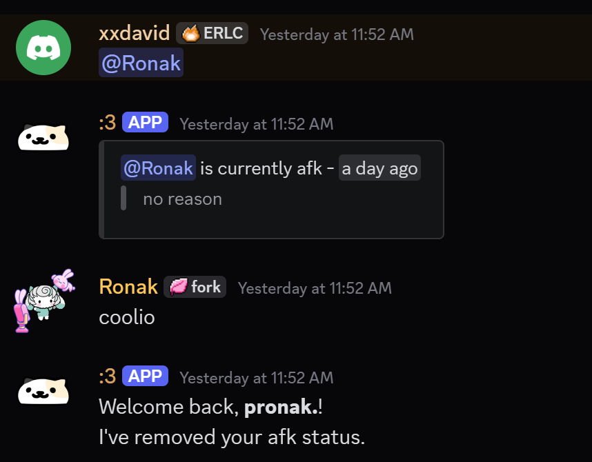

import Details from '@theme/Details';

# Message Event Listener
This is required in order to detect user mentions and messages.



:::warning  
Before starting, go to your [Discord Developer Portal](https://discord.com/developers/applications) and make sure that the **Message Content Intent** is enabled for your bot.

<Details summary="Message Content Intent">

</Details>
:::

# Creating an Event Listener
Go to your **[Kite Dashboard](https://kite.onl/) > Event Listeners** and create a new listener.  
Select the **event type** as **Message Create**.

## Get Stored Variable
- Variable : **afk**
- Set Temporary Variable : `list`

## **Comparison Condition**
- Base Value : `{{any(var('list') ?? [], user.id == .id)}}`

## *Match Condition*

| Comparison Mode | Comparison Value |
| :---: | :---: |
| **Equal** | `{{true}}` |

### Calculate Value
- Set Temporary Variable : `update`

```go title="Expression"
let list = var('list');
let item = findIndex(list, .id == user.id);

concat(list[:item], list[item+1:])
```

### Create Channel Message
- Target Channel : `{{channel.id}}`
- **Message Content :**
```md
Welcome back, **{{user.username}}**!
I've removed your afk status.
```

### Set Stored Variable
- Variable : **afk**
- Operation : **Overwrite**
- Value : `{{var('update')}}`

## *Else*

### Comparison Condition
- Base Value : 
```
{{any(var('list') ?? [], message.content contains "<@" + .id + ">")}}
```

- **Match Condition**  

| Comparison Mode | Comparison Value |
| :---: | :---: |
| **Equal** | `{{true}}` |

### Calculate Value
- Set Temporary Variable : `mentioned`

```go title="Expression"
let list = var('list') ?? [];
let mentions = filter(list, message.content contains "<@" + .id + ">");

len(mentions) == 1 ?
	[
		"<@" + mentions[0].id + "> is currently afk - <t:" + toJSON(mentions[0].time) + ":R>",
		"> " + mentions[0]?.reason ?? "no reason"
	]
:
	[
		"The users : " + join(map(mentions, "<@" + .id + ">"), ", ") + " are currently afk."
	]
```

### Create Channel Message
- Target Channel : `{{channel.id}}`
- Add an embed

```go title="Embed Description"
{{var('mentioned') | join("\n")}}
```

