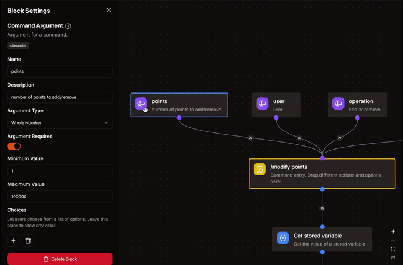
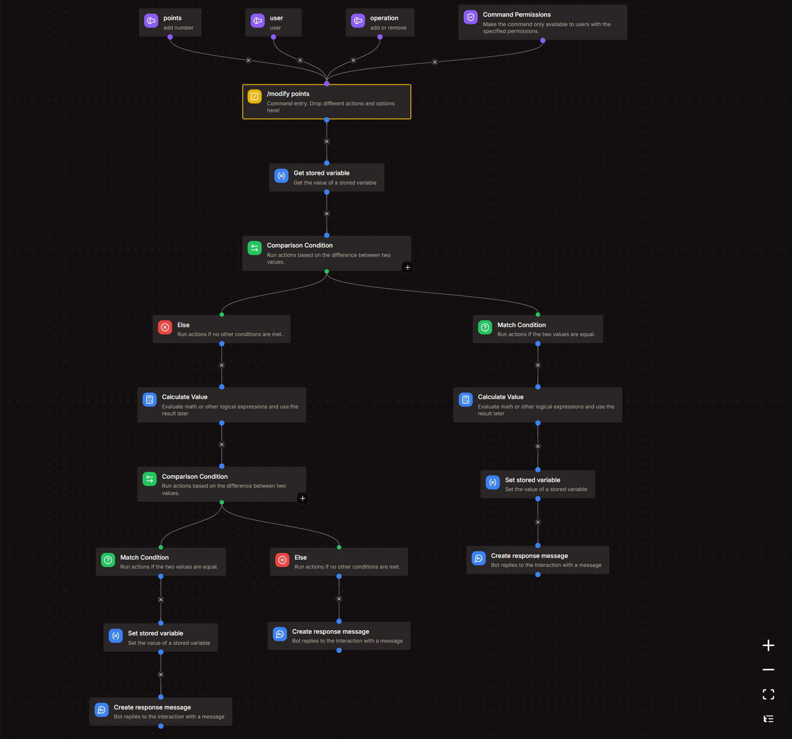
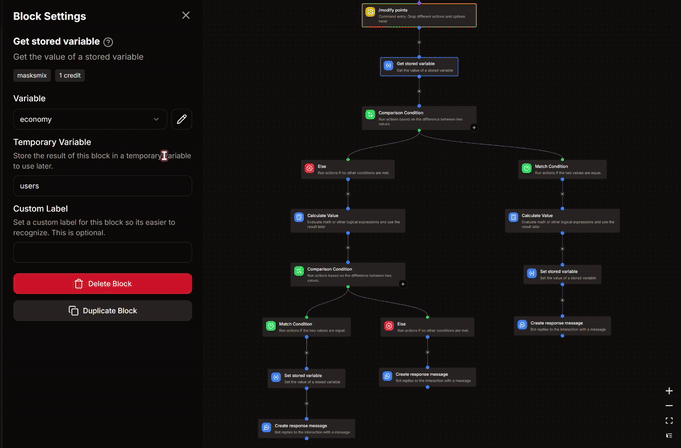

import On from '@site/src/assets/toggle_on.svg';
import Off from '@site/src/assets/toggle_off.svg';
import Match from '@site/src/assets/match.svg';
import Else from '@site/src/assets/else.svg';

# Add-Item command
*this command would allow admins to add items in the shop.*

  

## 🛠️ Arguments and Permissions
### Arguments
| Arguments | Description | Type | Values | Required |
| :---: | --- | --- | --- | :---: |
| `id` | id of the item - no special characters allowed | **Text** | Max Length : **50** | **True** <On className="inline-svg" /> |
| `name` | name of item | **Text** | Max Length : **50** | <On className="inline-svg" /> |
| `price` | price for the item | **Whole Number** |  | <On className="inline-svg" /> |
| `description` | short description of the item | **Text** | Max Length : **150** | <On className="inline-svg" /> |
| `reward_role` | role to give as reward | **Role** |  | <On className="inline-svg" /> |
| `required_role` | role required to buy this item | **Role** |  | **False** <Off className="inline-svg" /> |
| `stock` | remaining stock for the item | **Whole Number** |  | <Off className="inline-svg" /> |
| `response` | extra notes to add in response when someone buys this item | **Text** | Max Length : **150** | <Off className="inline-svg" /> |


### Command Permissions
**MANAGE GUILD** *or* **ADMIN**, *modify it according to you.*



## 📝 Step 2 : Get Stored Variable
- Variable : **economy**
- Set Temporary Variable : `users`

## 🔄️ Step 3 : Comparison Condition
- Base Value : `{{arg('operation')}}`
- **Match Condition**
  - Comparison Mode : **Equal**
  - Comparison Value : `add`



## 3.A. Match Condition <Match className="inline-svg" />
---
### 1. Calculate Value Block
:::danger
**DO NOT CHANGE** anything that you don't understand.
:::
```go title="Expression"
let list = var('users') ?? [];
let target_user = arg('user').id;
let points = arg('points');

any(list, .id == target_user) ?
    map(list, .id == target_user ? {"id": .id, "points": .points + points} : #) :
    concat(list, [{"id": target_user, "points": points}])
```

### 2. Set Stored Variable
- Variable : **economy**
- Operation : **Overwrite**
- Value : `{{result('CALCULATE_VALUE')}}`
-# Replace **CALCULATE_VALUE** with your respective block's name.

### 3. Create Response Message
```md title="📋 Copy or edit this, and put it into your response message."
Added **{{arg('points')}}** to **{{arg('user').username}}**
```

## 3.B. Else Condition <Else className="inline-svg" />
---
### 1. Calculate Value Block
:::danger
**DO NOT CHANGE** anything that you don't understand.
:::
```go title="Expression"
let list = var('users') ?? [];
let target_user = arg('user').id;
let points = arg('points');

let modify = find(list, .id == target_user);

points <= (modify?.points ?? 0) ?
    map(list, .id == target_user ? {"id": .id, "points": .points - points} : #) :
    "error"
```
- Set Temporary Variable : `modify`

### 2. Comparison Condition
- Base Value : `{{type(var('modify'))}}`  
- **Match Condition**
  - Comparison Mode : **Equal**
  - Comparison Value : `array`

### 2.i. **Match condition** <Match className="inline-svg" />  
1. **Set Stored Variable**
    - Variable : **economy**
    - Operation : **Overwrite**
    - Value : `{{var('modify')}}`

2. **Create Response Message**
```md
Removed **{{arg('points')}}** from **{{arg('user').username}}**
```

### 2.ii. **Else condition** <Else className="inline-svg" />  
**Create Response Message**  
```md title="📋 Copy or edit this, and put it into your response message."
# ⚠️ Error
*either the user doesn't have any points or you're trying to remove more points than what the user already has.*
```
:::info
It is recommended to look at the GIF attached below as it shows all the blocks & their settings step-wise.
Make sure your command structure matches the structure shown in the GIF.


:::