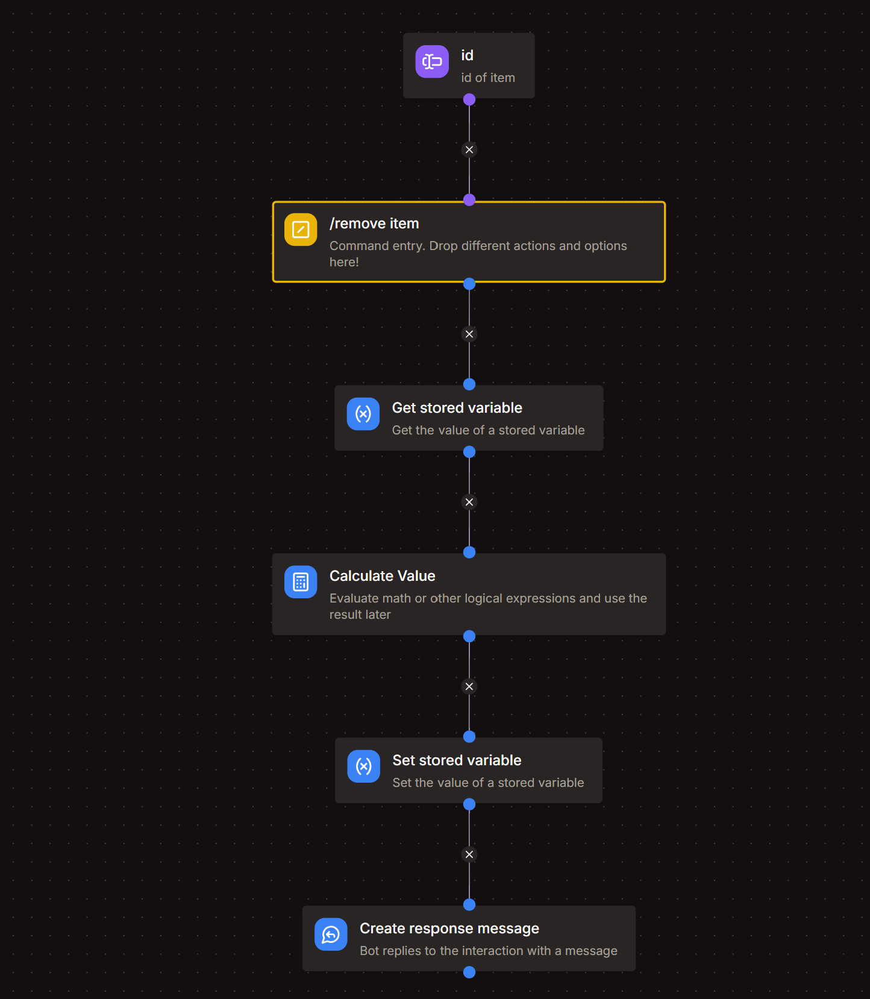

import On from '@site/src/assets/toggle_on.svg';

# Remove-Item command

*this command would allow admins to remove items with certain ID from the shop.*
- `/remove item`  

  

## Arguments and Permissions
### Arguments
- `id`
 - Description : id of item to remove
 - Argmunet Type : **Text**
 - Required : True  <On className="inline-svg"/>

### Command Permissions
**MANAGE GUILD** *or* **ADMIN**, *modify it according to you.*

## Get Stored Variable
- Variable : **shop**
- Set Temporary Variable : `shop`

## Calculate Value
```go title="Expression"
let shop = var('shop');
let item = findIndex(shop, .id == arg('id'));

concat(shop[:item], shop[item+1:])
```

## Set stored variable
    - Variable : **shop**
    - Operation : **Overwrite**
    - Value : `{{result('CALCULATE_VALUE')}}`

## Create Response Message
> `done 👌`