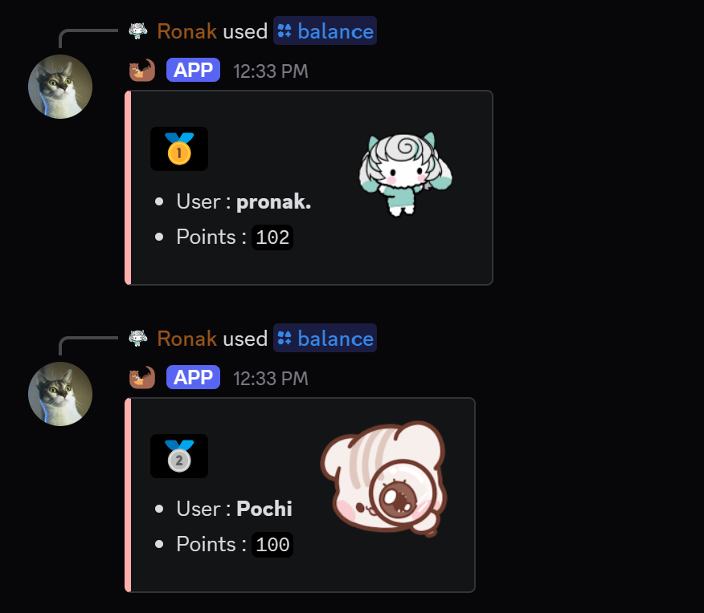
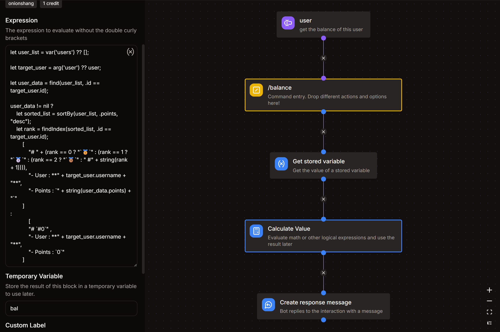

# Balance command

*this command would allow users to check their balance (as well as others')*  
- `/balance`

  

## 🛠️ Arguments
- **`user`**
    - Description : get the balance of this user
    - Type : **User**
    - Argument Required : **False** ( this argument should be set as optional )

## 📝 Get Stored Variable
- Variable : **economy**
- Set Temporary Variable : `users`

## 🧮 Calculate Value
- Set Temporary Variable : `bal`
:::danger
**DO NOT CHANGE** anything that you don't understand.
:::
```go title="Expression"
let user_list = var('users') ?? [];

let target_user = arg('user') ?? user;

let user_data = find(user_list, .id == target_user.id);

user_data != nil ?
    let sorted_list = sortBy(user_list, .points, "desc");
    let rank = findIndex(sorted_list, .id == target_user.id);
        [
            "# " + (rank == 0 ? "`🥇`" : (rank == 1 ? "`🥈`" : (rank == 2 ? "`🥉`" : " #" + string(rank + 1)))),
            "- User : **" + target_user.username + "**",
            "- Points : `" + toJSON(user_data.points) + "`"
        ]
:
            [
            "# `#0`" ,
            "- User : **" + target_user.username + "**",
            "- Points : `0`"
        ]
```

## 💬 Create Response Message
- Click on **Edit Message**
- Add an embed
- In the description box, copy paste this :
```md title="Embed Description"
{{type(var('bal')) == "array" ? join(var('bal'), '\n') : var('bal')}}
```
- For the thumbnail, copy paste this :
```md title="Thumbnail URL"
{{(arg('user') ?? user).avatar_url}}
```

