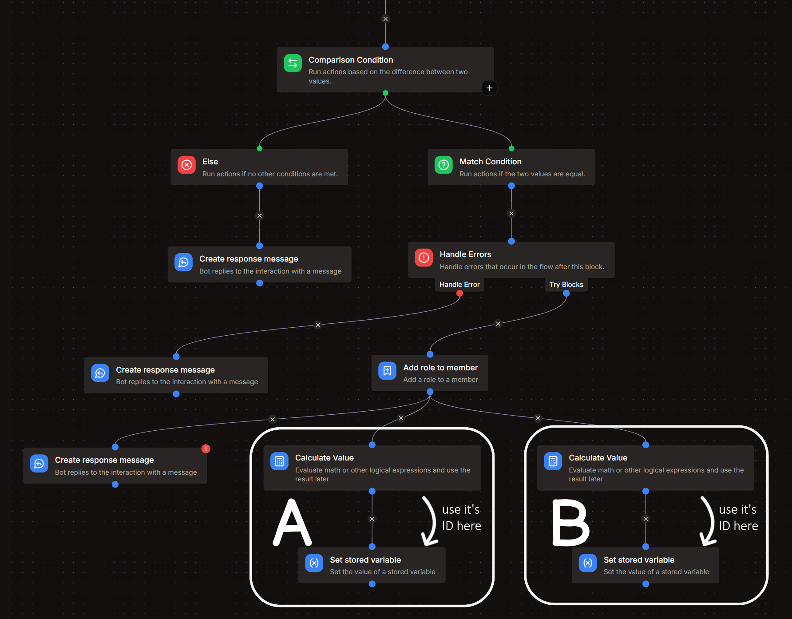

import Admonition from '@theme/Admonition';
import Details from '@theme/Details';
import Tabs from '@theme/Tabs';
import TabItem from '@theme/TabItem';
import Heading from '@theme/Heading';
import On from '@site/src/assets/toggle_on.svg';

# Buy command

*this command would allow items from the shop.*
- `/buy`

  

## Arguments
**`id`**
- Description : id of item you want to buy
- Type : **Text**
- Argument Required : **True** <On className="inline-svg"/>

## Get Stored Variable - 1
- Variable : **shop**
- Set Temporary Variable : `shop`

> You would need another **Get Stored Variable** block for this command.

## Get Stored Variable - 2
- Variable : **economy**
- Set Temporary Variable : `users`

<Details summary="Image Reference">
  
</Details>

## Calculate Value
- Temporary Variable : `item`
```go title="Expression"
let list = var('shop') ?? [];
let currency = "🪙";
let item = find(list, .id == arg('id'));

let balance = find(var('users'), .id == user.id)?.points ?? 0;

item != nil && !( item.role in user.role_ids ) && ( item.require in user.role_ids || item.require == nil ) && ( item.stock == nil || item.stock > 0 ) && balance >= item.price ?
	item
    :
    [
		"# ⚠️ Error",
		"*Make sure the item exists, you have the required role, it's in stock, and you have enough points*",
		"-# *and you cannot buy a role that you already have.*",
		"- **Your Balance :** " + toJSON(balance) + " " + currency,
		"- **Item Price :** " + (item != nil ? toJSON(item.price) + " " + currency : "N/A"),
		"- **Item Stock :** " + (item != nil ? (item.stock != nil ? toJSON(item.stock) : "Unlimited") : "N/A"),
		"- **Required Role :** " + (item != nil ? (item.require != nil ? "<@&" + item.require + ">" : "None") : "N/A"),
	]
```

## Comparison Condition
- Base Value : `{{type(var('item'))}}`

### Else

> I've shown the `else` part before in this section as the setup for **Match Condition** is quite complex.

- Create Response Message

```text title="Response Message"
{{var('item') | join("\n")}}
```

### Match Condition
---

| Comparison Mode | Comparison Value |
| :---: | :---: |
| Equal | `array` |

<Heading as="h2">Handle Errors Block</Heading>

- Add a **Handle Errors** block after the match condition. 
- *scroll down this page if you want an Image Reference*

> <Heading as="h3">Handle Errors</Heading>

<Admonition type="danger" icon="⚠️" title="Error Response Message">
- Add **Create Response Message** block after the "Handle Errors" option and paste the following text.
```text title="Create Response Message"
# ⚠️ Error
- The bot doesn't have appropriate permissions, *or*
- Bot's highest role isn't ranked higher than the reward role, *or*
- The reward role has been deleted / doesn't exist anymore.
```
</Admonition>

> <Heading as="h3">Try Blocks</Heading>
<Admonition type="info" icon="🧩" title="Add Role to Member">
- Target User : `{{user}}`
- Target Role : `{{var('item').role}}`
</Admonition>

<Admonition type="info" icon="💬" title="Create Response Message">
- Create an embed
```go title="Embed Description"
You have successfully bought the item : ** {{var('item').name}}**
*and received the role* - <@&{{var('item').role}}>

> You balance has been reduced by {{var('item').price}} 🪙
```

- Field Name : `Extra Notes :`
```text title="Field Value"
{{var('item').response ?? "none"}}
```
</Admonition>

<Admonition type="info" icon="🛍️" title="Updating item stock and member balance">

The following blocks need to be **adjacent** to the **CREATE RESPONSE MESSAGE** block as shown in the image. 
<Details summary="Image Reference">

</Details>

<Admonition type="note" icon="🧮" title="Calculate Value blocks">
<Tabs groupId="storedVariable">
  <TabItem value="user" label="A - for member balance" default>
    ```go title="Expression"
    let list = var('users');
    map(list, .id == user.id ? 
    {
      "id": .id,
      "points": .points - var('item').price
    } : #)
    ```
  </TabItem>
  <TabItem value="shop" label="B - for item stock">
    ```go title="Expression"
    let list = var('shop');
    let item = findIndex(list, .id == arg('id'));
    
    map(list, #index == item ?
    {
        "id": .id,
        "stock": .stock != nil ? .stock - 1 : .stock,
        "name": .name,
        "role": .role,
        "require": .require,
        "price": .price,
        "desc": .desc,
        "response": .response
    }
    : #)
    ```
  </TabItem>
</Tabs>
</Admonition>

<Admonition type="note" icon="📝" title="Set Stored Variable blocks">
<Tabs groupId="storedVariable">
  <TabItem value="user" label="A - for member balance" default>
    - Variable : **economy**
    - Operation : Overwrite
    - Value : `{{result('CALCULATE_VALUE_BLOCK')}}`

    > *replace **CALCULATE_VALUE_BLOCK** with the the ID of the block just above this.*
  </TabItem>
  <TabItem value="shop" label="B - for item stock">
    - Variable : **shop**
    - Operation : Overwrite
    - Value : `{{result('CALCULATE_VALUE_BLOCK')}}`

    > *replace **CALCULATE_VALUE_BLOCK** with the the ID of the block just above this.*
  </TabItem>
</Tabs>
</Admonition>
</Admonition>