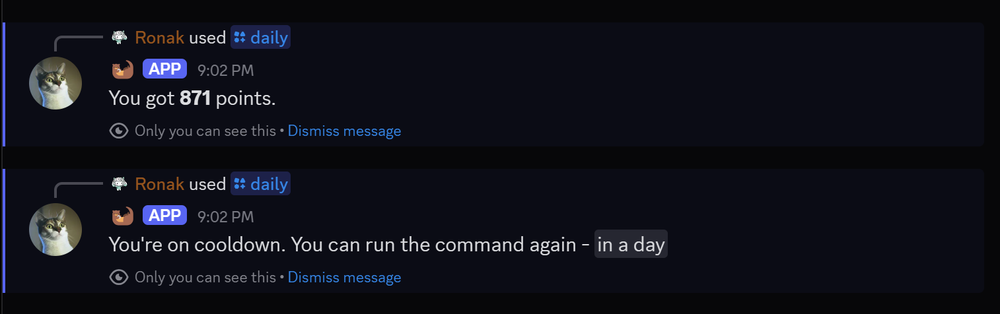
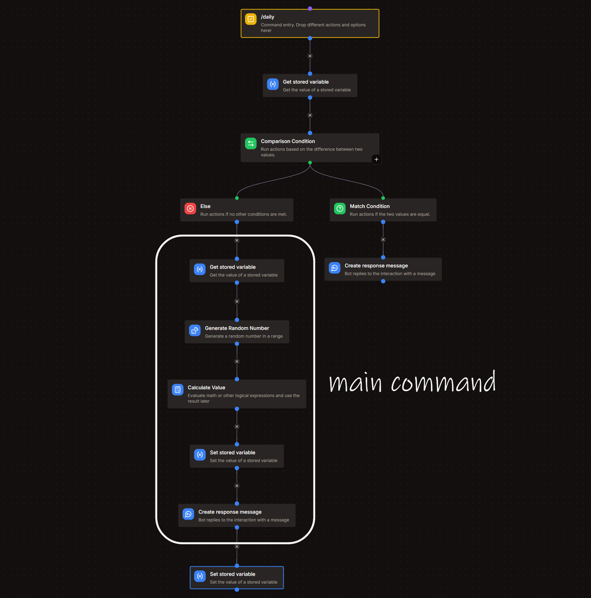

# Daily Command
*this command would allow users to claim their daily rewards.*
- `/daily`



## Cooldown
The first step is to set a cooldown for this command so that users can only claim their daily reward once every **24 hours**.  

You can do so by referring to the [cooldown documentation](../cooldowns.md).  
While setting up the cooldown, make sure to use the scope `daily-{{user.id}}`



# Response
The following steps need to be added after the [**else block** of the cooldown flow.](../cooldowns.md#response)

## Get Stored Variable
- Variable : **economy**
- Set Temporary Variable : `users`

## Generate Random Number
- Minimum Value : **50**
- Maximum Value : **1000**

:::note
You can change the minimum and maximum values to your desired daily reward range.
:::

## Calculate Value
```go title="Expression"
let list = var('users') ?? [];
any(list, .id == user.id) ?
    map(list, .id == user.id ? {"id": .id, "name": user.username, "points": .points + result('GENERATE_RANDOM_NUMBER')} : #) :
    concat(list, [{"id": user.id, "name": user.username, "points": result('GENERATE_RANDOM_NUMBER')}])
```
> *replace **GENERATE_RANDOM_NUMBER** with the ID of the respective block*

## Set stored variable
- Variable : **economy**
- Operation : **Overwrite**
- Value : `{{result('CALCULATE_VALUE')}}`

> *replace **CALCULATE_VALUE** with the ID of the respective block*

## Create Response Message
- Message Content : `You have claimed your daily reward of **{{result('GENERATE_RANDOM_NUMBER')}} 🪙**! Come back tomorrow for more.`

> *replace **GENERATE_RANDOM_NUMBER** with the ID of the block.*

:::note
Don't forget to add the last step of the cooldown flow - [**Set Stored Variable**](../cooldowns.md#setting-variable-value) block to update the cooldown timer.
:::

:::tip
This setup can also be used to make a `work` command, just edit the cooldown time and reward range.
:::