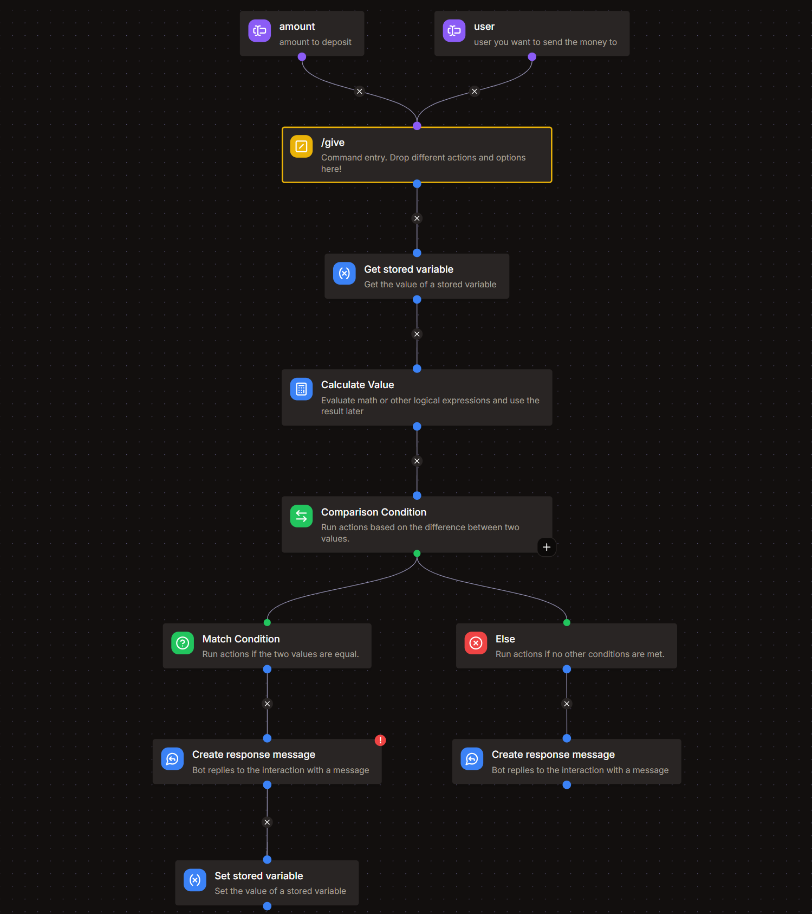

# Give command
*This command would allow users to give their currency to another user*

`/give`


## Arguments
1. **`amount`**
    - Description : amount to transfer
    - Type : **Whole Number**
    - Argument Required : **True**
    - Minimum Value : **10**
    - Maximum Value : *your choice ( optional )*

2. **`user`**
    - Description : user you want to send the money to
    - Type : **User**
    - Argument Required : **True**

## Get Stored Variable
- Variable : **economy**
- Set Temporary Variable : `users`

## Calculate Value
- Temporary Variable : `transfer`
```go title="Expression"
let list = var('users') ?? [];
let receiver = arg('user').id;
let amount = arg('amount');

let sender = find(list, .id == user.id);

(sender?.points ?? 0) >= amount && amount > 0 && sender.id != receiver ?
	let update = any(list, .id == receiver) ? list : concat(list, [{"id": receiver, "points": 0}]);
    map(update,
        .id == sender.id ?
            {"id": .id, "points": .points - amount} : 
			.id == receiver ? 
				{"id": .id, "points": .points + amount} : #)
:
	nil
```



## Comparision Condition
Base Value : `{{type(var('transfer'))}}`

### Match Condition
- Comparison Mode : **Equal**
- Comparison Value : `array`

1. **Create Response Message**
    - Add an embed
    - In the description box, copy paste this :  
    `💸 Successfully transferred **{{arg('amount')}}** 🪙 to **{{arg('user').username}}**!`

2. **Set Stored Variable**
    - Variable : **economy**
    - Operation : **Overwrite**
    - Value : `{{var('transfer')}}`

### Else Condition

**Create Response Message**

```md title="Message Content"
❌ Transaction failed! You might not have enough balance or you are trying to send money to yourself.
```