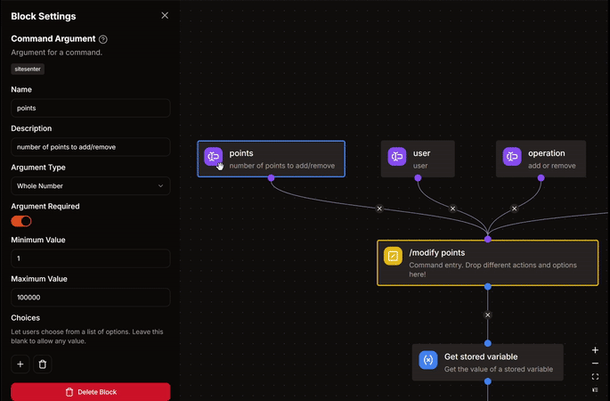
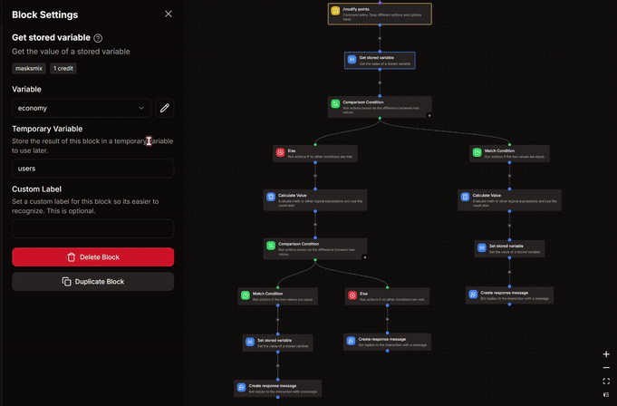

import Match from '@site/src/assets/match.svg';
import Else from '@site/src/assets/else.svg';

# Modify-Points command
*this command would allow admins to modify points of users.*

  

## 🛠️ Step 1 : Arguments and Permissions
### Arguments
1. **`points`**
    - Description : number of points to add/remove
    - Type : **Whole Number**
    - Argument Required : **True**
    - Minimum Value : **1**
    - Maximum Value : *your choice ( I've put 100000 in my example )*

2. **`user`**
    - Description : user whose points need to be modified
    - Type : **User**
    - Argument Required : **True**

3. **`operation`**
    - Description : add or remove
    - Type : **Text**
    - Argument Required : **True**
    - **Choices** :
     - **Add** : `add`
     - **Remove** : `remove`

### Command Permissions
**MANAGE GUILD** *or any modify it according to you.*



## 📝 Step 2 : Get Stored Variable
- Variable : **economy**
- Set Temporary Variable : `users`

## 🔄️ Step 3 : Comparison Condition
- Base Value : `{{arg('operation')}}`
- **Match Condition**
  - Comparison Mode : **Equal**
  - Comparison Value : `add`


## Match Condition <Match className="inline-svg" />
---
### 1. Calculate Value Block
:::danger
**DO NOT CHANGE** anything that you don't understand.
:::
```go title="Expression"
let list = var('users') ?? [];
let target_user = arg('user').id;
let points = arg('points');

any(list, .id == target_user) ?
    map(list, .id == target_user ? {"id": .id, "points": .points + points} : #) :
    concat(list, [{"id": target_user, "points": points}])
```

### 2. Set Stored Variable
- Variable : **economy**
- Operation : **Overwrite**
- Value : `{{result('CALCULATE_VALUE')}}`
-# Replace **CALCULATE_VALUE** with your respective block's name.

### 3. Create Response Message
```md title="📋 Copy or edit this, and put it into your response message."
Added **{{arg('points')}}** to **{{arg('user').username}}**
```

## Else Condition <Else className="inline-svg" />
---
### 1. Calculate Value Block
:::danger
**DO NOT CHANGE** anything that you don't understand.
:::
```go title="Expression"
let list = var('users') ?? [];
let target_user = arg('user').id;
let points = arg('points');

let modify = find(list, .id == target_user);

points <= (modify?.points ?? 0) ?
    map(list, .id == target_user ? {"id": .id, "points": .points - points} : #) :
    "error"
```
- Set Temporary Variable : `modify`

### 2. Comparison Condition
- Base Value : `{{type(var('modify'))}}`  
- **Match Condition**
  - Comparison Mode : **Equal**
  - Comparison Value : `array`

| **Match condition** <Match className="inline-svg" /> |
| :---: |
1. **Set Stored Variable**
    - Variable : **economy**
    - Operation : **Overwrite**
    - Value : `{{var('modify')}}`

2. **Create Response Message**
```md
Removed **{{arg('points')}}** from **{{arg('user').username}}**
```

| **Else condition** <Else className="inline-svg" /> |
| :---: |

**Create Response Message**  
```md title="📋 Copy or edit this, and put it into your response message."
# ⚠️ Error
*either the user doesn't have any points or you're trying to remove more points than what the user already has.*
```
:::info
It is recommended to look at the GIF attached below as it shows all the blocks & their settings step-wise.
Make sure your command structure matches the structure shown in the GIF.


:::