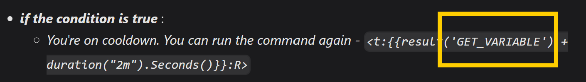
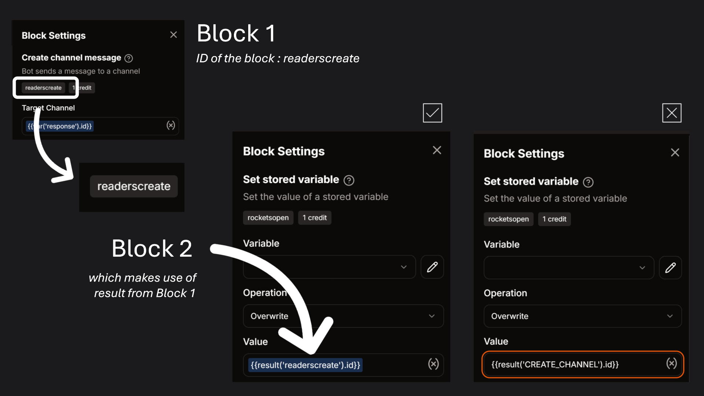
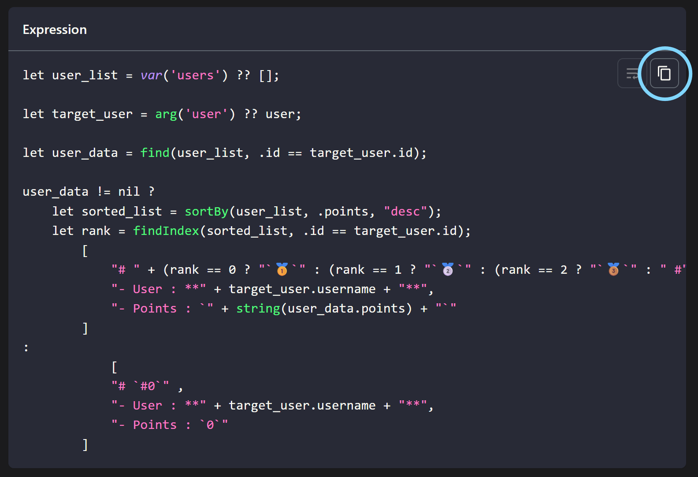

import Mention from '@site/src/components/DiscordMention';
import Support from '@site/src/assets/question.svg';
import Star from '@site/src/assets/star.svg';

# Intro

This is page is maintained and writted by **pronak.** / **Ronak**. This tutorial page was created to help users create complex and advanced commands with their Kite custom bots.  

Before getting started, it is recommended that you read the below given headings.

## Usage/Credits
I do not require credits if you're using the commands from this page in your server.

**But** for people who make bots for a fee, if you're using any commands from this page, I would ask you to **not charge** people for these commands or claim them as your work.

*Similarly, I would want server-owners to be aware of people who ask you to pay fees for "making an economy bot", etc. because all they are doing is copy-pasting stuff from this website.*

## Block IDs/Names

You'll often see see this line in the tutorials :
- Replace `BLOCK_NAME` in `{{result('BLOCK_NAME')}}` with your actual block's name/id.
- When replacing the placeholders, the ID you're putting should be of the block that the placeholder is pointing to.

:::note[For Example]
In the below image, the `result('GET_VARIABLE')` is pointing to the **Get Stored Variable** block. So when replacing the placeholder, you should replace it with the ID of that block. 

:::

- This will **usually** (not everytime) be referring a block which is immediately before the block which is using the `result` function.

Here's a demostration of what it means :

## Copying codeblocks/expressions

The tutorials shown here would often make use **Calculate Value** blocks whose expressions are shown in codeblocks. To copy the expression simply hover over the top-right corner of the codeblock and click on the clipboard 📋 icon.

## Suggestions <Star className="inline-svg" />

To make suggestions, you can write in the <Mention link="https://discord.com/channels/845800518458540083/1413000245117325452"># showcase</Mention> channel where the links to the tutorials were posted or open an issue on the [Github Repo](https://github.com/ronaksahai/kite-tutorials/issues)

## Support <Support className="inline-svg" />

Stuck while building the commands? **No problem!**  
Just open a thread in the <Mention link="https://discord.com/channels/845800518458540083/1282656116416843848"># support</Mention> channel in the [Kite Support Server](https://discord.gg/dvGj3CmwP6)