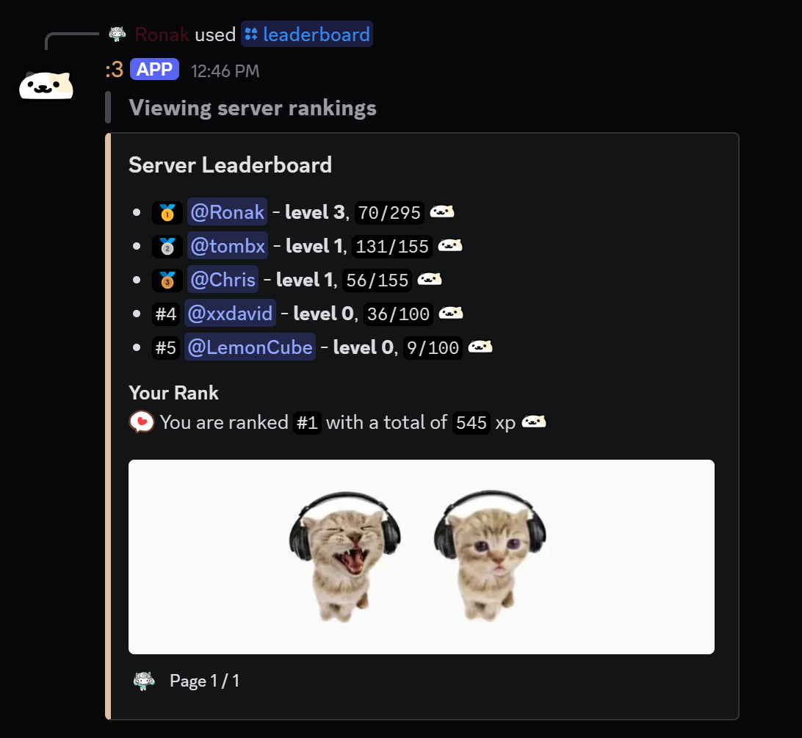
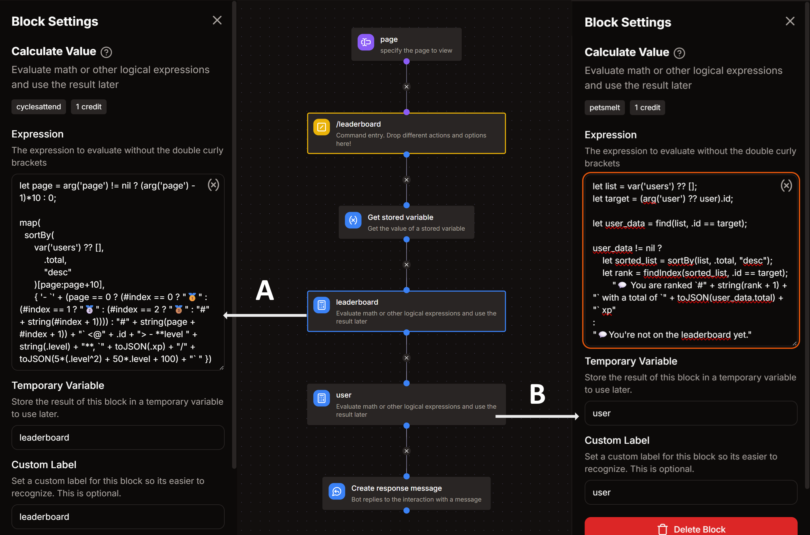

import Off from '@site/src/assets/toggle_off.svg';

# Leaderboard command

*this command shows the server level rankings, from top to bottom*  
- `/leaderboard`



## Arguments
- **`page`**
    - Description : leaderboard's page number
    - Type : **Whole Number**
    - Argument Required : **False** ( <Off className="inline-svg"/> )
    - Minimum Value : **1**

## Get Stored Variable
- Variable : **levels**
- Set Temporary Variable : `users`

## Calculate Value - A
- Temporary Variable : `leaderboard`
```go title="Expression, Temporary Variable = leaderboard"
let page = arg('page') != nil ? (arg('page') - 1)*10 : 0;

map(
  sortBy(
      var('users') ?? [],
          .total,
          "desc"
      )[page:page+10],
      { '- `' + (page == 0 ? (#index == 0 ? "🥇" : (#index == 1 ? "🥈" : (#index == 2 ? "🥉" : "#" + string(#index + 1)))) : "#" + string(page + #index + 1)) + "` <@" + .id + "> - **level " + string(.level) + "**, `" + toJSON(.total) + "` xp" })
```

## Calculate Value - B
- Temporary Variable : `user`
```go title="Expression, Temporary Variable = user"
let list = var('users') ?? [];
let target = (arg('user') ?? user).id;

let user_data = find(list, .id == target);

user_data != nil ?
    let sorted_list = sortBy(list, .total, "desc");
    let rank = findIndex(sorted_list, .id == target);
    "💬 You are ranked `#" + string(rank + 1) + "` with a total of `" + toJSON(user_data.total) + "` xp"
:
"💬 You're not on the leaderboard yet."
```

## Create Response Message
- Add an embed
- Build embed as follows :

```go title="Embed Description"
{{join(var('leaderboard'), '\n')}}
```
```go title="Embed Footer"
{{user.username}} • Page {{arg('page') ?? 1}} / {{var('users') ?? "0" | len()/10 | ceil()}}
```
- Additionally add a `Field` in the embed with the name **Your Rank** and put this in field value :
```go title="Field Value"
{{var('user')}}
```


:::tip
*You can edit other parts of the embed such as image, color, etc. as you wish!*
:::