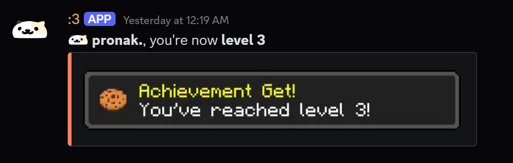
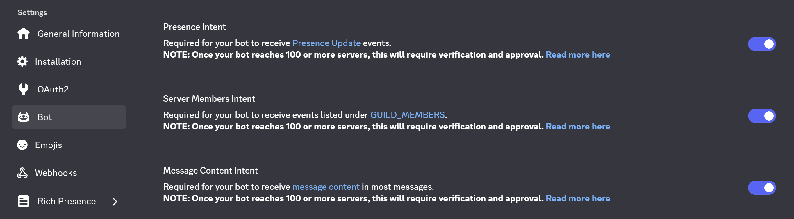
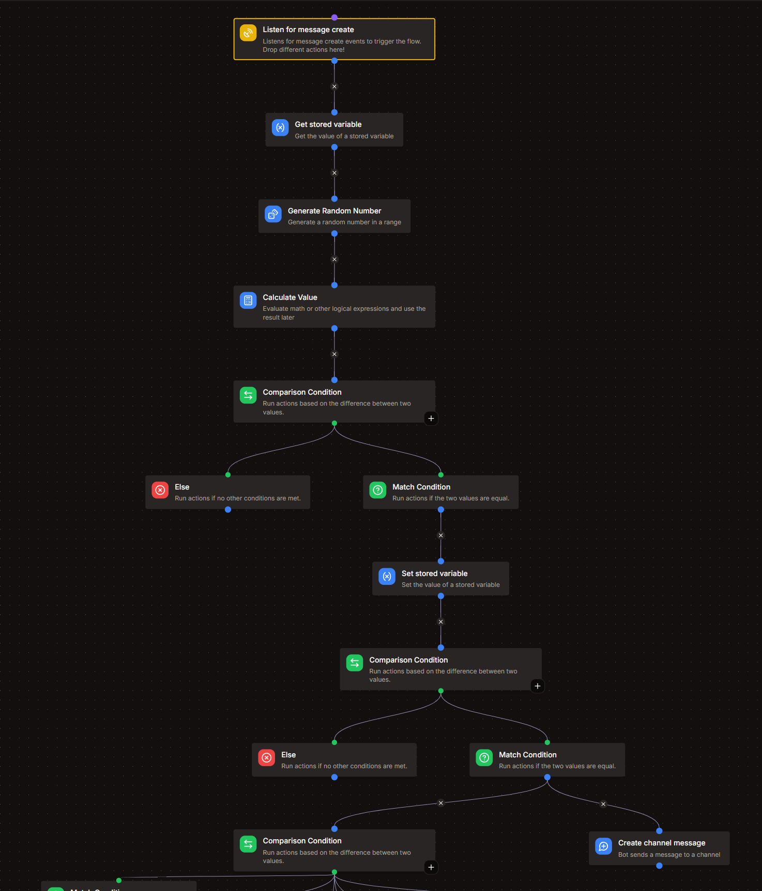
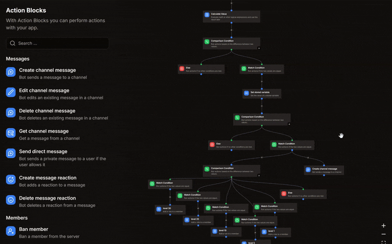
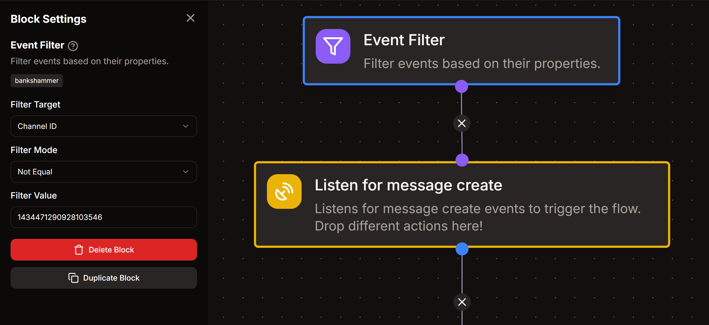

import Details from '@theme/Details';

# Message Event Listener
This is required to track messages in order to give XP to users.



:::warning  
Before starting, go to your [Discord Developer Portal](https://discord.com/developers/applications) and make sure that the **Message Content Intent** is enabled for your bot.

<Details summary="Message Content Intent">

</Details>
:::

# Creating an Event Listener
Go to your **[Kite Dashboard](https://kite.onl/) > Event Listeners** and create a new listener.  
Select the **event type** as **Message Create**.

## Get Stored Variable
- Variable : **levels**
- Set Temporary Variable : `users`

## Generate Random Number
- Min Value : **15**
- Max Value : **25**

- Set Temporary Variable : `xp_gained`

## Calculate Value
- Set Temporary Variable : `xp`
```go title="Expression"
let list = var('users') ?? [];
let user_data = find(list, .id == user.id);

now().Unix() - (user_data?.active ?? 0) > 60 ?
	let current_xp = (user_data?.xp ?? 0) + var('xp_gained');
	let xp_needed = 5*((user_data?.level ?? 0)^2) + 50*(user_data?.level ?? 0) + 100;
	let xp = current_xp >= xp_needed ? current_xp - xp_needed : current_xp;
	let level = current_xp >= xp_needed ? (user_data?.level ?? 0) + 1 : (user_data?.level ?? 0);

	{
		"update": user_data != nil ? 
		map(list, .id == user.id ? {"id": .id, "xp": xp, "level": level, "total": .total + var('xp_gained'), "active": now().Unix()} : #) :
		concat(list, [{"id": user.id, "xp": xp, "level": level, "total": var('xp_gained'), "active": now().Unix()}]),
		"announce": level > (user_data?.level ?? 0) ? true : false,
        "level_up": level > (user_data?.level ?? 0) ? level : nil
	}

: nil
```

## Comparison Condition - **1**
- Base Value : `{{type(var('xp'))}}`

- **Match Condition**

| Comparison Mode | Comparison Value |
| :---: | :---: |
| **Equal** | `map` |

### Set Stored Variable
- Variable : **levels**
- Operaation : **Overwrite**
- Value : `{{var('xp').update}}`

## Comparison Condition - **2**
- Base Value : `{{var('xp').announce}}`

- **Match Condition**  

| Comparison Mode | Comparison Value |
| :---: | :---: |
| **Equal** | `{{true}}` |

### Create Channel Message
- Target Channel : `{{channel.id}}`

- **Message Content :**
```md
**{{user.username}}**, you're now **level {{var('xp').level_up}}**
```
:::note
This will send the level-up notification in the current channel (wherever the user sent the last message).  

To specify a channel for level-up notifications, put the **channel ID** as the target channel.  
*for eg. if `123` is your channel ID, put `123` in the Target Channel.*
:::
:::tip[Level-up Images]  
You can optionally add a level-up card to the message as shown [above](#).
- **Add an embed** and in the **Image URL**, put this :  
```text
https://api.alexflipnote.dev/achievement?text=You%27ve%20reached%20level%20{{var('xp').level_up}}!&icon=8
```  
*This will automatically update according to the level achieved.*
:::



## Setting Level Roles
1. To set-up level roles, add a **Comparison Condition** block **adjacent** to the **Create Channel Message** block.  
	- Base Value : `{{string(var('xp').level_up)}}`  

2. For each level where you want to assign a role, add a **Match Condition**.
	- **Comparison Mode** : `Equal`
	- **Comparison Value** : *your level number*  
***for eg.** : if you want to give a role for **level 5**, your value will be **5**.*  

3. After the respective **Match Condition**, add an **Add role to member** block.
	- **Target User** : `{{user}}`
	- **Target Role** : *your role ID*

<Details summary="Setting Level Roles Example">

</Details>

## Blacklist Channels
To prevent users from gaining XP in certain channels (like bot-commands, announcements, etc.), you can use **Event Filters** at the top of your event listener.  
Use separate filters for each channel you want to blacklist.

<Details summary="Channel Blacklist Example">

</Details>