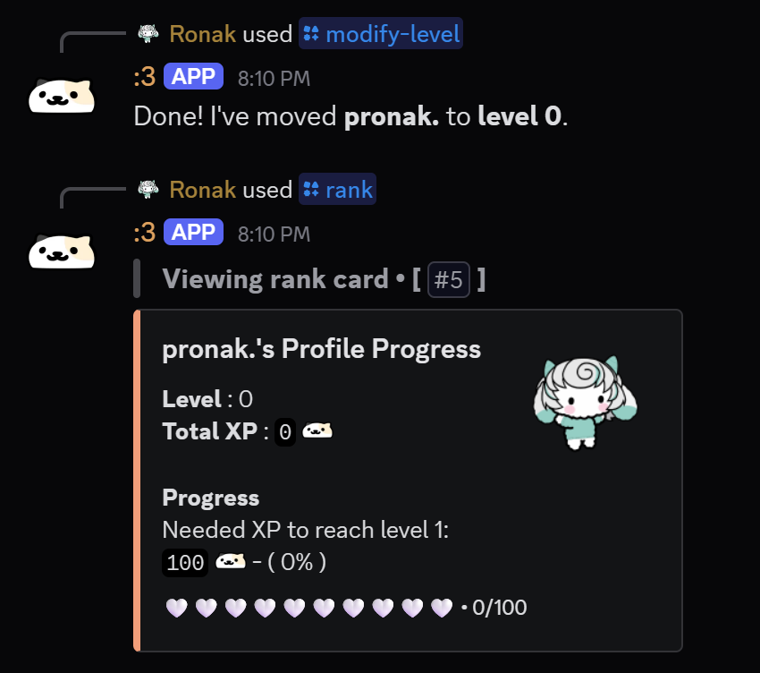
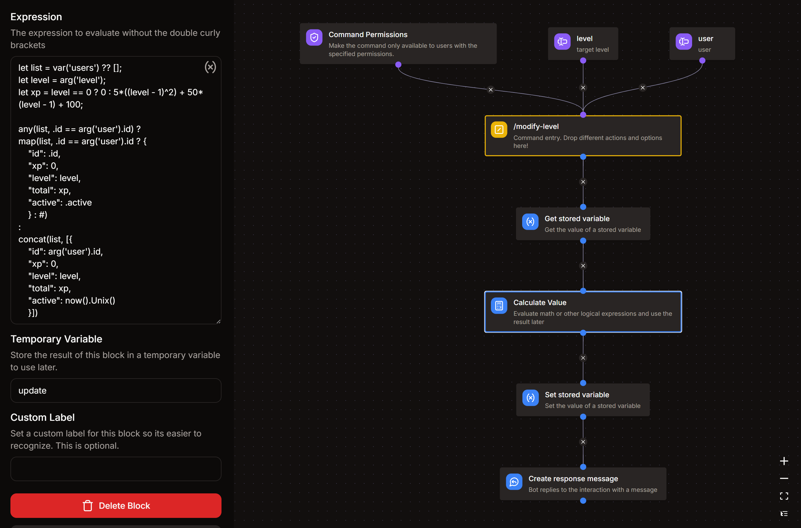

# Modify-Level command
*this command would allow admins to modify the level of users.*  
- `/modify-level`



:::note
Updating the user's role based on the modified level is currently not supported. You may have to update them manually.
:::

## Arguments
1. **user**
    - Description : **user whose level need to be modified**
    - Type : **User**
    - Argument Required : **True**

2. **level**
    - Description : **target level**
    - Type : **Whole Number**
    - Argument Required : **True**
    - Minimum Value : **leave empty**
    - Maximum Value : **999** (It is not recommended to modify levels beyond this)

## Command Permissions
- Required Permission : **MANAGE GUILD** *(recommended)*

## Get Stored Variable
- Variable : **levels**
- Set Temporary Variable : `users`

## Calculate Value
- Set Temporary Variable : `update`  
```go title="Expression"
let list = var('users') ?? [];
let level = arg('level');
let xp = level == 0 ? 0 : 5*((level - 1)^2) + 50*(level - 1) + 100;

any(list, .id == arg('user').id) ? 
map(list, .id == arg('user').id ? {
	"id": .id,
	"xp": 0,
	"level": level,
	"total": xp,
	"active": .active
	} : #)
:
concat(list, [{
	"id": arg('user').id,
	"xp": 0,
	"level": level,
	"total": xp,
	"active": now().Unix()
	}])
```

## Set Stored Variable
- Variable : **levels**
- Operation : **Overwrite**
- Value : `{{var('update')}}`

## Create Response Message
```md title="Message Content"
Done! I've moved **{{arg('user').username}}** to **level {{arg('level')}}**.
```

