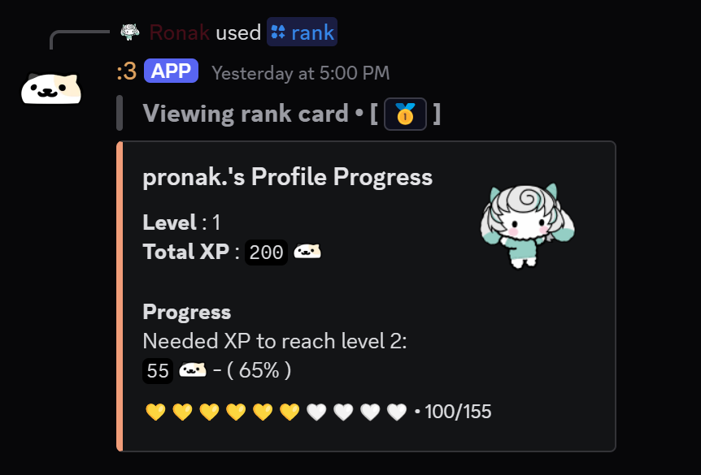
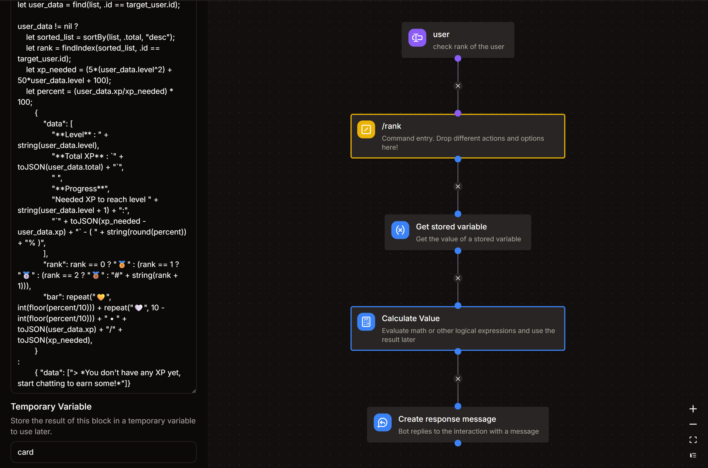

# Rank command

*this command would allow users to check their rank and level (as well as others')*  
- `/rank`

  

## Arguments
- **`user`**
    - Description : view the rank card of this user
    - Type : **User**
    - Argument Required : **False** ( this argument should be set as optional )

## Get Stored Variable
- Variable : **levels**
- Set Temporary Variable : `users`

## Calculate Value
- Set Temporary Variable : `card`
:::danger
**DO NOT CHANGE** anything that you don't understand.
:::
```go title="Expression"
let list = var('users') ?? [];
let target_user = arg('user') ?? user;

let user_data = find(list, .id == target_user.id);

user_data != nil ?
    let sorted_list = sortBy(list, .total, "desc");
    let rank = findIndex(sorted_list, .id == target_user.id);
    let xp_needed = (5*(user_data.level^2) + 50*user_data.level + 100);
    let percent = (user_data.xp/xp_needed) * 100;
        {
            "data": [
                "**Level** : " + string(user_data.level),
                "**Total XP** : `" + toJSON(user_data.total) + "`",
                " ",
                "**Progress**",
                "Needed XP to reach level " + string(user_data.level + 1) + ":",
                "`" + toJSON(xp_needed - user_data.xp) + "` - ( " + string(round(percent)) + "% )",
            ],
            "rank": rank == 0 ? "🥇" : (rank == 1 ? "🥈" : (rank == 2 ? "🥉" : "#" + string(rank + 1))),
            "bar": repeat("🟢", int(floor(percent/10))) + repeat("⚪", 10 - int(floor(percent/10))) + " • " + toJSON(user_data.xp) + "/" + toJSON(xp_needed),
        }
:
        { "data": ["> *You don't have any XP yet, start chatting to earn some!*"]}
```

## Create Response Message
- **Message Content** :
```md title="Message Content"
> **Viewing rank card • [** `{{var('card')?.rank ?? "No rank"}}` **]**
```
- **Embed** :
```md title="Embed Title"
{{(arg('user') ?? user).username}}'s Profile Progress
```
```md title="Embed Description"
{{join(var('card').data, '\n')}}
```
```md title="Embed Footer"
{{var('card')?.bar ?? ""}}
```
```md title="Thumbnail URL"
{{(arg('user') ?? user).avatar_url}}
```

